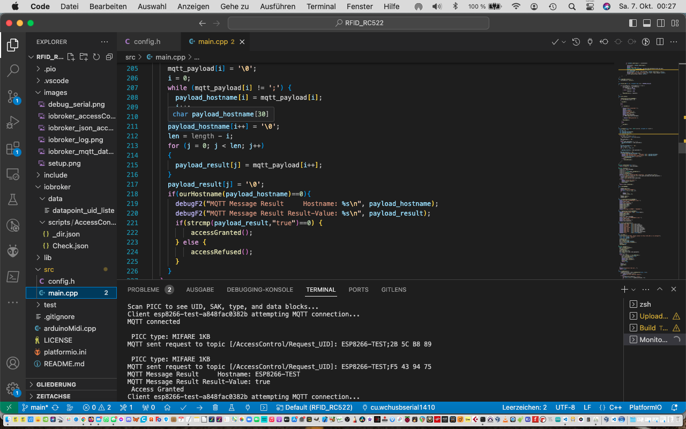

# RFID_RC522 Access Control System with MQTT Steering/Config over iobroker

The basic system is steered/controlled by a JSON config in a iobroker datapoint. You specify here exactly which IDs are allowed or disallowed. Future version will do that better and check which sensor sends data to allow/deny. 

## Components
* WEMOS D1 Mini ESP8266 oder Clone
* RFID RC522 kit(s)

## IOBROKER config/MQTT datapoints

see file datapoint_uid_liste in folder data as an example 

## First Setup
After installing the firmware to your sensor the system does not find any config in EEPROM. An AP is activated with SSID Setup and no password. You can configure each sensor than with connection to http://192.168.4.1

##Sample IOBROKER log entries

##Debug output

